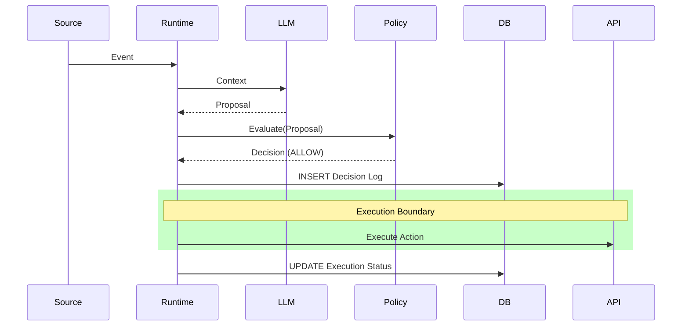

# Architecture & Integration Guide

This document is the "serious integration manual" for architects and engineers integrating `abs-core` into production systems.

## 1. Module Structure (Monorepo)

The project is structured into three distinct packages to separate concerns:

- **`@abs/core`**: The Runtime. Handles execution, policy gating, and logging.
- **`@abs/scan`**: The Scanner. Static analysis tool to find governance violations (Shift Left).
- **`@abs/cli`**: Unified CLI (`abs`) to orchestrate scan and runtime.

## 2. Runtime Overview
**ABS Core** acts as a **Safety Middleware** (or Sidecar) between your reasoning engine (LLM) and your execution layer (APIs, DBs).

It converts probabilistic suggestions into deterministic, governed actions.

| Component | Role | Responsibility |
| :--- | :--- | :--- |
| **Provider (LLM)** | Reasoning | Analyzes context and *proposes* an action. |
| **Policy Engine** | Governance | Evaluates the proposal against hard-coded invariants. |
| **Decision Log** | Audit | Immutably records the *intent* and the *decision*. |
| **Executor** | Action | Performs the side-effect only if Allowed. |

## 2. The Canonical Flow

Every operation in an ABS follows this strict sequence:

1.  **Event Ingestion**: System receives a signal (Webhook, Cron, User Input).
2.  **Context Assembly**: State is gathered (e.g., User Profile, Ticket Status).
3.  **Proposal (Probabilistic)**: LLM suggests: `Proposal = { action: 'refund', params: { amount: 50 }, confidence: 0.9 }`.
4.  **Proposal Validation**: Schema check (Zod).
5.  **Policy Evaluation (Deterministic)**: `Policy(Proposal) -> ALLOW | DENY | REVIEW`.
6.  **Decision Logging (Immutable)**: Result is written to DB. **(Stop here if DENY/FAIL)**.
7.  **Execution (Side-Effect)**: `Executor.run(action)`.
8.  **Execution Logging**: Consequence is written to DB.



## 3. Core Contracts

### Event Envelope
Standard wrapper for all inputs.
```typescript
interface EventEnvelope {
  event_id: string;
  event_type: string; // e.g. "ticket.created"
  payload: any;
}
```

### Decision Proposal
The output of the LLM.
```typescript
interface DecisionProposal {
  recommended_action: string;
  action_params: Record<string, any>;
  confidence: number;
  explanation: { rationale: string };
}
```

### Decision Log
The immutable record of the decision.
```typescript
interface DecisionLog {
  decision_id: string; // uuid
  event_id: string;
  proposed_action: string;
  policy_decision: 'ALLOW' | 'DENY' | 'ESCALATE';
  policy_rule_id: string;
  rationale: string;
  inputs_hash: string;
  created_at: string; // ISO8601
}
```

### Execution Log
The record of what actually happened.
```typescript
interface ExecutionLog {
  decision_id: string;
  status: 'EXECUTED' | 'SKIPPED_POLICY' | 'FAILED';
  executor: string;
  latency_ms: number;
  error?: string;
  executed_at: string; // ISO8601
}
```

## 4. Integration Patterns

### A. The "Gatekeeper" Middleware (Recommended)
`abs-core` sits between your Chatbot and your Backend.
- Chatbot sends intent to ABS.
- ABS decides.
- ABS executes or returns "Blocked" to Chatbot.

### B. The "Sidecar" Auditor
`abs-core` runs alongside a legacy system.
- Legacy system proposes action.
- ABS logs and validates.
- Legacy system executes only on allowance.

## 5. Architectural Constraints (Forbidden)

1.  **Direct-to-Execution**: The LLM must NEVER call an API directly. It must return a JSON Proposal.
2.  **Bypassing the Log**: Execution code must depend on a successful Log ID.
3.  **Dynamic Policy**: Policies must be code (TypeScript) or Versioned Config. They cannot be hallucinated by the LLM.
