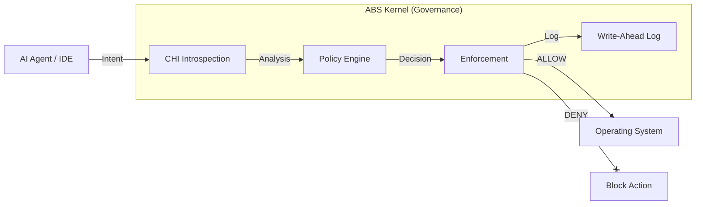

# ABS Kernel (formerly ABS Core)

> **The Immune System for AI Agents.**
>
> **Governance Runtime** that prevents LLMs from executing dangerous actions.
> Start with visibility (**Scanner**), upgrade to control (**Enforcement**).

[](LICENSE)
[](https://abscore.app)
[](https://github.com/eusheriff/abs-core)

---

## 🔍 What is ABS Kernel?

ABS Kernel defines **how agents can exist** without executing them. It acts as a **Cognitive Host Interface (CHI)** between your AI Agent (Cursor, Windsurf, LangChain) and the operating system.

- **🛡️ Intercept**: Analyzes every tool call, file write, and network request.
- **🧠 Decide**: Evaluates actions against **Cognition Profiles** and policies.
- **📝 Evidence**: Logs tamper-proof audit trails (WAL) with cryptographic integrity.

---

## ⚡ How it Works (Architecture)



### The "ABS Triangle"
1. **Governance (Kernel)**: The immutable engine that enforces rules.
2. **Cognition Interface (CHI)**: Analysis layer that understands intent (e.g., "recursive delete detected").
3. **Layers (Profile/Workspace)**: Trust hierarchy separating user config from kernel logic.

---

## 🚀 Getting Started

### 1. Install ABS CLI

```bash
npm install @oconnector/abs-sdk-typescript
```

### 2. Configure a Policy (Profile Layer)

Create `~/.abs/profile.yaml` to define your safety boundaries:

```yaml
# ~/.abs/profile.yaml
abs_profile:
  version: "1.0"
  preferences:
    default_risk_threshold: medium
    require_approval_for_delete: true
  capabilities:
    can_disable_safe_mode: false
```

### 3. Run a Scan (Visibility)

Check your project for policy violations before the agent runs:

```bash
abs scan --path ./src
```

### 4. Enforcement (Runtime Protection)

When integrated via the VS Code Extension or SDK, ABS blocks dangerous actions:

> **Agent**: "I will delete all files in /tmp"
>
> **ABS**: `DENY` (Rule: `fs.delete:**/*` requires approval)
>
> **Logs**: Saved to `WORKLOG.wal` with HMAC signature.

---

## 🏗️ Architecture: Core vs. Profile

To maintain security while allowing personalization, ABS uses **Layer Separation** (ADR-005):

| Layer | Owner | Role | Trust Level |
|-------|-------|------|-------------|
| **Kernel** | ABS | Immutable governance engine | Absolute |
| **Profile** | User/Org | Global preferences rules | Semi-Trusted |
| **Workspace** | Project | Project-specific overrides | Untrusted |
| **Input** | Agent | Runtime prompts/actions | Zero Trust |

---

## 🛡️ Security Posture

We follow **OWASP Top 10 for LLM Applications**.

- **Prompt Injection**: Mitigated via CHI Introspection and Input Layer sanitization.
- **Excessive Agency**: Controlled via Whitelisting and Cognition Profiles.
- **Tampering**: All decisions are signed (HMAC-SHA256) and hash-chained.

See [SECURITY.md](docs/SECURITY.md) for the full threat model.

---

## 📦 Commercial & Licensing

- **ABS Scanner (CLI/SDK)**: Open Source (**Apache 2.0**). Free forever.
- **ABS Runtime (@oconnector/abs-sdk-typescript)**: Official Runtime SDK. Apache 2.0.
- **ABS Enterprise**: Volume-based licensing for production fleets (SLA, Support).

[Contact Sales](https://abscore.app) for Enterprise details.

---

### Code Map

- `packages/core`: The ABS Kernel.
- `packages/sdk-typescript`: Official Runtime SDK (Node.js).
- `packages/vscode`: VS Code Extension.
- `packages/scanner`: Legacy Analysis SDK.

&copy; 2026 OConnector Technology.
