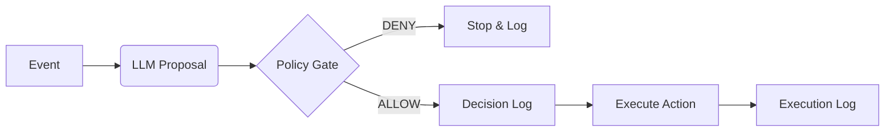

# ABS Core
> **Autonomous Business System (Runtime)**
> `v0.5-audited`

[](LICENSE)
[](docs/AUDIT_MASTER_v0.5.md)

**abs-core** is an open-source runtime designed to govern autonomous business decisions.
It acts as a safety middleware between your LLM (Reasoning) and your Execution Layer (Actions).

### Why it exists
> **LLMs are probabilistic. Business execution must not be.**
> ABS Core bridges that gap.

## What is ABS?
*   A runtime that enforces **Decision Integrity** for autonomous business processes.
*   The LLM **Proposes** actions.
*   The Policy Engine **Decides** (Allow/Deny).
*   The System **Logs** (Immutable Audit Trail).
*   Only then, the System **Executes**.

## Non-Goals
To avoid confusion, this project is explicitly:
*   **NOT** a General Purpose Agent Framework (like AutoGPT).
*   **NOT** a Chatbot Framework.
*   **NOT** Robotic Process Automation (RPA).
*   **NOT** a promise of "Full Autonomy" without supervision.

## Architecture (The Governance Loop)



Note: The **Decision Log** happens *strictly before* Execution. If the DB insert fails, the action is never attempted.

## Quick Start (Zero Config)
Runs in mock mode by default. No API keys required.

### 1. Install & Run
```bash
git clone https://github.com/oconnector/abs-core.git
cd abs-core
npm install
npm run dev
# Server running at http://localhost:3000
```

### 2. Simulate Event
```bash
curl -X POST http://localhost:3000/v1/events \
  -H "Content-Type: application/json" \
  -d '{
    "event_id": "evt_001",
    "event_type": "ticket.created",
    "occurred_at": "2026-01-19T14:00:00Z",
    "tenant_id": "demo",
    "payload": { "text": "I need enterprise support immediately." }
  }'
```

The system will use the `MockProvider` and `SimplePolicyEngine`.
Check the console to see: `🛡️ Policy: ALLOW (notify_sales)`.

---

## Security Posture
We follow the **OWASP Top 10 for LLM Applications**.
*   **LLM01 (Prompt Injection)**: Inputs are sanitized and strictly delimited.
*   **LLM08 (Excessive Agency)**: Actions are whitelisted in the Policy Engine.

See [SECURITY.md](SECURITY.md) for full details.

## Governance
This runtime enforces invariants that cannot be bypassed by the LLM.
See [INVARIANTS.md](INVARIANTS.md).

## License
Apache 2.0
