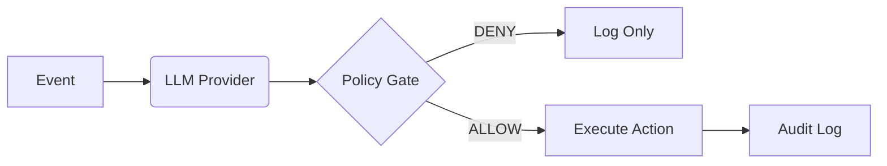

# ABS Core 🛡️
> **Autonomous Business System (Runtime)**
>
> *Autonomia com responsabilidade. Decisões de IA governadas por políticas auditáveis.*

[](LICENSE)
[](docs/AUDIT_MASTER_v0.5.md)
[](https://www.typescriptlang.org/)

**abs-core** é um runtime open-source projetado para orquestrar processos de negócio autônomos com **segurança e governança** em primeiro lugar. Ele atua como um "middleware de responsabilidade" entre seu modelo de IA (LLM) e suas execuções (APIs/Webhooks).

---

## 🛑 O Problema
Ligar um LLM diretamente em uma API de execução (`LLM -> Tool Call -> Action`) é perigoso.
- **Alucinações** viram bugs em produção.
- **Prompt Injection** vira vazamento de dados.
- **Falta de Logs** estruturados torna impossível auditar "por que a IA fez isso?".

## ✅ A Solução
O ABS Core impõe um ciclo de vida estrito para cada decisão:



1.  **Event**: Entrada de dados.
2.  **Proposal**: LLM sugere uma ação (mas não executa).
3.  **Policy**: Código determinístico valida a sugestão (Invariantes).
4.  **Log**: Decisão gravada imutavelmente.
5.  **Execute**: Webhook/Adapter disparado apenas se aprovado.

---

## 🚀 Quick Start (5 min)

### 1. Clone & Install
```bash
git clone https://github.com/oconnector/abs-core.git
cd abs-core
npm install
```

### 2. Configure
```bash
cp .env.example .env
# Adicione sua OPENAI_API_KEY ou configure LLM_PROVIDER=gemini
```

### 3. Run Dev Server
```bash
npm run dev
# Server running at http://localhost:3000
```

### 4. Simule um Evento
```bash
# Enviar um evento de 'mensagem recebida'
curl -X POST http://localhost:3000/v1/events \
  -H "Content-Type: application/json" \
  -d '{
    "event_id": "evt_123",
    "event_type": "message.received",
    "payload": { "text": "Quero comprar o plano Enterprise agora!" },
    "tenant_id": "demo",
    "timestamp": "2026-01-19T10:00:00Z"
  }'
```

### 5. Check Dashboard
Acesse `http://localhost:3000/dashboard` para ver a decisão logada e o status de execução.

---

## 🏛️ Governança & Segurança

Este projeto segue princípios rígidos de **Decision Integrity**:
- [INVARIANTS.md](INVARIANTS.md): Regras inegociáveis do runtime.
- [SECURITY.md](SECURITY.md): Postura contra OWASP LLM Top 10.
- [AUDIT_MASTER.md](docs/AUDIT_MASTER_v0.5.md): Relatório da última auditoria técnica.

## 🤝 Contribuição

PRs são bem-vindos, mas devem respeitar os Invariantes de Integridade.
Leia [CONTRIBUTING.md](CONTRIBUTING.md) antes de começar.

## 📜 Licença

Apache 2.0 - Veja [LICENSE](LICENSE) para detalhes.

---
*Construído com TypeScript, Hono, SQLite e Zod.*
