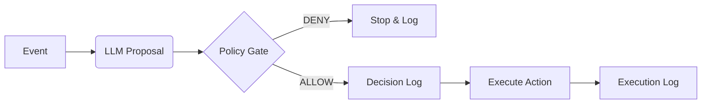

# ABS Core
> **Autonomous Business System (Runtime)**
> `v2.0.0`

[](LICENSE)
[](https://github.com/eusheriff/abs-core/actions/workflows/ci.yml)
[](https://github.com/eusheriff/abs-core/actions)

> **ABS Core is not an agent framework.**
> It is a governed runtime that prevents probabilistic models from executing unbounded actions.

**abs-core** is an open-source **reference runtime** designed to govern autonomous business decisions.
It acts as a safety middleware between your LLM (Reasoning) and your Execution Layer (Actions).

🔎 *Confused by the acronym? See [Disambiguation](GLOSSARY.md).*  
📜 *Read our [Project Philosophy](PROJECT_PHILOSOPHY.md).*

### Why it exists
> **LLMs are probabilistic. Business execution must not be.**
> ABS Core bridges that gap.

## What is ABS?
*   A runtime that enforces **Decision Integrity** for autonomous business processes.
*   The LLM **Proposes** actions.
*   The Policy Engine **Decides** (Allow/Deny).
*   The System **Logs** (Immutable Audit Trail).
*   Only then, the System **Executes**.

## Non-Goals
To avoid confusion, this project is explicitly:
*   **NOT** a General Purpose Agent Framework (like AutoGPT).
*   **NOT** a Chatbot Framework.
*   **NOT** Robotic Process Automation (RPA).
*   **NOT** a promise of "Full Autonomy" without supervision.

## Architecture (The Governance Loop)



Note: The **Decision Log** happens *strictly before* Execution. If the DB insert fails, the action is never attempted.

## Quick Start (CLI Lab)
The fastest way to test the governance loop. No API keys required (runs in mock mode).

### 1. Install & Simulate
```bash
# Install dependencies
npm install

# Start the runtime (in terminal 1)
npm run dev

# Simulate an event (in terminal 2)
# This sends a payload through the Policy Gate -> Decision Log -> Execution
npm run abs -- simulate ticket.created -d '{"text": "Urgent refund needed"}'
```

### Installation in Other Projects

You can use the CLI directly in other projects without publishing to npm:

**Option 1: Run via npx (No Install)**
```bash
npx github:eusheriff/abs-core simulate ticket.created -d '{"text": "Hello"}'
```

**Option 2: Install as Dependency**
```bash
npm install -g github:eusheriff/abs-core
# Then run anywhere:
abs --help
```

### 2. Inspect the Decision Log
```bash
# See why a decision was made
npm run abs -- logs --limit 1
```

You should see:
```text
┌──────────────────────────────────────┬────────────────┬──────────┬───────────┬──────────────────────┐
│ ID                                   │ Event          │ Decision │ Latency   │ Time                 │
├──────────────────────────────────────┼────────────────┼──────────┼───────────┼──────────────────────┤
│ 8bbe99ee-6412-4b19-b7e8-096837567d26 │ ticket.created │ allow    │ 45ms      │ 2026-01-19T17...     │
└──────────────────────────────────────┴────────────────┴──────────┴───────────┴──────────────────────┘
```

---

## Security Posture
We follow the **OWASP Top 10 for LLM Applications**.
*   **LLM01 (Prompt Injection)**: Inputs are sanitized and strictly delimited.
*   **LLM08 (Excessive Agency)**: Actions are whitelisted in the Policy Engine.

See [SECURITY.md](SECURITY.md) for full details.

## Governance
This runtime enforces invariants that cannot be bypassed by the LLM.
See [INVARIANTS.md](INVARIANTS.md).

## License
Apache 2.0
