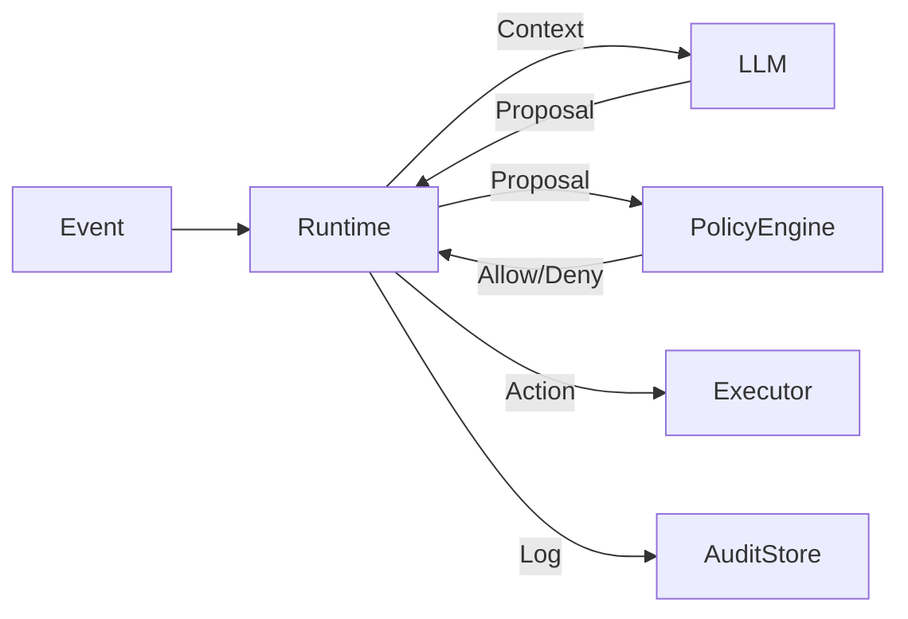

<p align="center">
  
  
  
</p>

# ABS Core: Autonomous Business Systems

> **A governance-first runtime for autonomous business decisions.**

ABS Core is a neutral runtime that governs autonomous business decisions through explicit state, policies, audit trails, and human escalation. It acts as the "responsible brain" between your channels (bots, APIs) and your execution capability.

*"Autonomy without governance is risk. ABS Core prioritizes reliability of decisions over intelligence of models."*

---

## ⚡️ Key Features

- **Decision separated from execution**: LLMs propose actions, ABS Core validates and executes.
- **Policies override intelligence**: Hard rules always win over probabilistic models.
- **Immutable Audit**: Every decision generates a business-readable `DecisionLog`.
- **Human-in-the-loop**: Native support for escalation workflows based on risk.
- **LLM Agnostic**: Zero dependency on specific vendors; structured inputs/outputs only.

---

## 🏗️ Architecture

ABS Core acts as a **decision runtime**:

1.  **Event Ingestion**: Receives normatlized events (`EventEnvelope`).
2.  **Process Resolution**: Loads the explicit State Machine for that process.
3.  **Decision Proposal**: Asks an LLM or Heuristic for a recommendation.
4.  **Policy Evaluation**: Validates the recommendation against versioned code rules.
5.  **Execution/Escalation**: Executes side-effects or queues for human review.
6.  **Audit**: Records the entire chain of thought and outcome.



---

## 🚀 Getting Started

### Prerequisites
- Node.js 20+

### Installation

```bash
git clone https://github.com/oconnector/abs-core.git
cd abs-core
npm install
npm run build
```

### Usage (CLI)

Simulate a decision flow locally:

```bash
# Validate an event payload
node dist/cli/index.js validate examples/lead_qualification_demo/events/1_message_received.json

# Run the simulation (Mock Engine)
node dist/cli/index.js simulate examples/lead_qualification_demo/events/1_message_received.json
```

---

## 📜 Documentation

- [**Manifesto**](docs/MANIFESTO.md): The philosophy behind ABS Core.
- [**Architecture**](docs/architecture.md): Detailed component breakdown.
- [**Governance**](docs/governance.md): How we manage the open core.
- [**Contracts**](specs/): OpenAPI and JSON Schemas for events and decisions.

---

## 🤝 Contributing

We welcome contributions that align with our **Governance-First** philosophy.

Please read [CONTRIBUTING.md](CONTRIBUTING.md) and [CODE_OF_CONDUCT.md](CODE_OF_CONDUCT.md) before submitting a Pull Request.

**Important**: We do not accept PRs that hide business logic inside prompts or bypass the audit layer.

---

## 📄 License

Apache License 2.0. See [LICENSE](LICENSE) for details.

Maintained by **OConnector Technology**.
