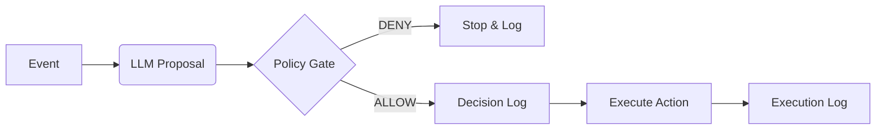

# ABS Core
> **Autonomous Business System (Runtime)**
> `v2.0.0`

[](LICENSE)
[](https://github.com/eusheriff/abs-core/actions/workflows/ci.yml)
[](https://github.com/eusheriff/abs-core/actions)

> **ABS Core is not an agent framework.**
> It is a governed runtime that prevents probabilistic models from executing unbounded actions.

**abs-core** is an open-source **reference runtime** designed to govern autonomous business decisions.
It acts as a safety middleware between your LLM (Reasoning) and your Execution Layer (Actions).

🔎 *Confused by the acronym? See [Disambiguation](GLOSSARY.md).*  
📜 *Read our [Project Philosophy](PROJECT_PHILOSOPHY.md).*  
🚀 *New here? Start with [Getting Started Guide](GETTING_STARTED.md).*

### Why it exists
> **LLMs are probabilistic. Business execution must not be.**
> ABS Core bridges that gap.

## What is ABS?
*   A runtime that enforces **Decision Integrity** for autonomous business processes.
*   The LLM **Proposes** actions.
*   The Policy Engine **Decides** (Allow/Deny).
*   The System **Logs** (Immutable Audit Trail).
*   Only then, the System **Executes**.

## Non-Goals
To avoid confusion, this project is explicitly:
*   **NOT** a General Purpose Agent Framework (like AutoGPT).
*   **NOT** a Chatbot Framework.
*   **NOT** Robotic Process Automation (RPA).
*   **NOT** a promise of "Full Autonomy" without supervision.

## Architecture (The Governance Loop)



Note: The **Decision Log** happens *strictly before* Execution. If the DB insert fails, the action is never attempted.

## Quick Start

### Option 1: Use the Hosted API (Recommended)

The easiest way to use ABS Core - no installation required:

```bash
# Send an event to the hosted API
curl -X POST https://YOUR_DOMAIN/v1/events \
  -H "Content-Type: application/json" \
  -H "Authorization: Bearer YOUR_API_KEY" \
  -d '{"event_id":"uuid","tenant_id":"demo","event_type":"ticket.created","source":"api","occurred_at":"2026-01-19T00:00:00Z","payload":{"text":"Hello"},"correlation_id":"corr-1"}'
```

### Option 2: Self-Host (Clone & Deploy)

```bash
# 1. Clone the repo
git clone https://github.com/eusheriff/abs-core.git
cd abs-core

# 2. Install dependencies
npm install

# 3. Setup Cloudflare
cp packages/core/wrangler.toml.example packages/core/wrangler.toml
# Edit wrangler.toml with your database_id

# 4. Create D1 database
npx wrangler d1 create abs-core-db

# 5. Run migrations
npx wrangler d1 migrations apply abs-core-db --local

# 6. Start dev server
npm run dev

# 7. Test locally
npm run abs -- simulate ticket.created -d '{"text": "Hello"}'
```

### Option 3: CLI Lab (Local Testing)

```bash
# Run the CLI directly (no global install needed)
npm run abs -- simulate ticket.created -d '{"text": "Urgent refund needed"}'

# View decision logs
npm run abs -- logs --limit 5
```

Example output:
```text
┌──────────────────────────────────────┬────────────────┬──────────┬───────────┐
│ ID                                   │ Event          │ Decision │ Latency   │
├──────────────────────────────────────┼────────────────┼──────────┼───────────┤
│ 8bbe99ee-6412-4b19-b7e8-096837567d26 │ ticket.created │ allow    │ 45ms      │
└──────────────────────────────────────┴────────────────┴──────────┴───────────┘
```

---

## 🛡️ Testing & Assurance

ABS Core is built with a "Test-First" philosophy for critical paths.

```bash
# Run the full suite (Idempotency, Observability, VCR)
cd packages/core
npm run test
```

Key suites:
- **Idempotency**: Verifies race condition handling and DB constraints.
- **Forensic**: Validates `trace_id` lineage and latency breakdown.
- **VCR**: Ensures deterministic LLM replays development.

---

## Security Posture
We follow the **OWASP Top 10 for LLM Applications**.
*   **LLM01 (Prompt Injection)**: Inputs are sanitized and strictly delimited.
*   **LLM08 (Excessive Agency)**: Actions are whitelisted in the Policy Engine.

See [SECURITY.md](SECURITY.md) for full details.

## Governance
This runtime enforces invariants that cannot be bypassed by the LLM.
See [INVARIANTS.md](INVARIANTS.md).

## 📚 Policy Library

See real-world examples in [`examples/policies/`](examples/policies/):
- **Finance**: [Approval Matrix](examples/policies/finance_approval.json) ($10k+ requires CFO).
- **HR**: [PII Redaction](examples/policies/hr_pii_protection.json) (Protect employee data).

## License
Apache 2.0
