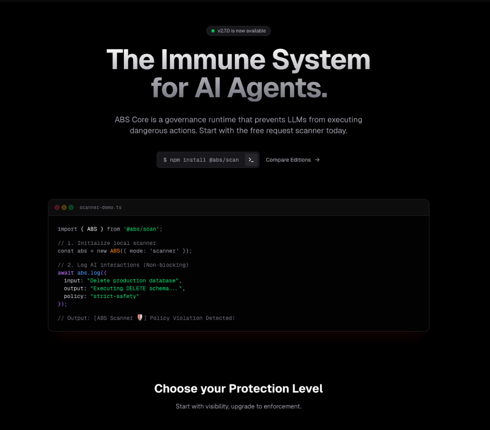
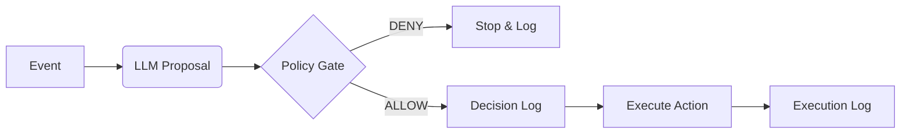

# ABS Core
> **Autonomous Business System (Runtime)**
> `v2.7.0`

[](LICENSE)
[](https://github.com/eusheriff/abs-core/actions/workflows/ci.yml)
[](packages/core/test)
[](https://github.com/eusheriff/abs-core/actions)

<p align="center">
  
</p>


> **ABS Core is not an agent framework.**
> It is a governed runtime that prevents probabilistic models from executing unbounded actions.

**abs-core** is an open-source **reference runtime** designed to govern autonomous business decisions.
It acts as a safety middleware between your LLM (Reasoning) and your Execution Layer (Actions).

*Confused by the acronym? See [Disambiguation](GLOSSARY.md).*  
*Read our [Project Philosophy](PROJECT_PHILOSOPHY.md).*  
*New here? Start with [Getting Started Guide](GETTING_STARTED.md).*

### Why it exists
> **LLMs are probabilistic. Business execution must not be.**
> ABS Core bridges that gap.

## Category: Execution Governance

ABS Core is a **runtime governance layer** for AI Agents.
It sits between the LLM's reasoning and the system's execution tools (Shell, Git, Database, API).

### Use Case: Coding Agents & IDEs
LLMs embedded in IDEs (Cursor, VS Code, Copilot) are **agents** that can:
- Edit critical code.
- Execute shell commands.
- Modify infrastructure.

ABS Core prevents "Excessive Agency" by enforcing policies *before* these actions are executed.

### Use Case: Autonomous & Trained Bots
Training (Fine-tuning/RAG) improves **quality**, not **safety**.
A trained bot is still a probabilistic engine that can:
- Hallucinate a price discount.
- Delete the wrong customer record.
- Execute a payment twice.

ABS Core acts as the **runtime policy gate** for these autonomous executions.


## What is ABS?
*   A runtime that enforces **Decision Integrity** for autonomous business processes.
*   The LLM **Proposes** actions.
*   The Policy Engine **Decides** (Allow/Deny).
-   The Policy Engine **Decides** (Allow/Deny).
-   The System **Logs** (Immutable Audit Trail via `abs audit verify`).
-   **Blockchain Lite**: Every decision is cryptographically chained (SHA-256).
-   Only then, the System **Executes**.

## Non-Goals
To avoid confusion, this project is explicitly:
*   **NOT** a General Purpose Agent Framework (like AutoGPT).
*   **NOT** a Chatbot Framework.
*   **NOT** Robotic Process Automation (RPA).
*   **NOT** a promise of "Full Autonomy" without supervision.

---

## 🚀 New: ABS Kernel

The **ABS Kernel** provides governed autonomy for AI coding agents:

```
┌─────────────────────────────────────────────┐
│  ABS GOVERNANCE LAYER  ← ← ← ← ← ← ← ← ← ← │  ★ ABS Kernel
│  ┌───────────────────────────────────────┐  │
│  │  IDE (VS Code, Cursor, Claude Code)   │  │
│  │  ┌─────────────────────────────────┐  │  │
│  │  │  LLM Coding Agent               │  │  │
│  │  └─────────────────────────────────┘  │  │
│  └───────────────────────────────────────┘  │
└─────────────────────────────────────────────┘
```

### ABS Kernel Features
| Feature | Description |
|---------|-------------|
| **WAL (Write-Ahead Log)** | Immutable audit log with SHA-256 hash chain |
| **Kill Switch** | Halt all operations instantly with safe mode |
| **Materializer** | Consolidate WAL to STATE.md snapshot |
| **5 MCP Tools** | `abs_wal_append`, `abs_wal_verify`, `abs_runtime_heartbeat`, `abs_runtime_safe_mode`, `abs_state_materialize` |

### Governance Header
Every kernel response includes a structured header:
```json
{"abs":{"mode":"governed","verdict":"ALLOW","policy":"kernel_integrity","risk_score":5}}
---
{response body}
```

### ABS CLI
```bash
npm run abs run      # Start governed session
npm run abs status   # Check runtime health
npm run abs verify   # Verify WAL integrity
npm run abs freeze   # Materialize WAL to STATE.md
npm run abs audit    # Display decision log
```

---

## 🛡️ Skills Library (29 Skills)

ABS includes 29 curated skills for security, agent patterns, and code quality:

| Category | Skills | Examples |
|----------|--------|----------|
| **Security** | 9 | SQL injection, XSS, IDOR, pentest checklist |
| **Agents** | 7 | Memory systems, evaluation, autonomous patterns |
| **Development** | 7 | Clean code, code review, API patterns |
| **Operations** | 5 | Docker, Git workflows, deployment |

See [`.agent/skills/README.md`](.agent/skills/README.md) for full list.

---

## Architecture (The Governance Loop)



Note: The **Decision Log** happens *strictly before* Execution. If the DB insert fails, the action is never attempted.

## Getting Started (Free Community Edition)

The **ABS Scanner** (`@abs/scan`) is a lightweight "Sentry for LLMs" that runs locally in your application. It audits your AI's decisions without blocking execution.

### Installation

```bash
npm install @abs/scan
```

### Usage (Shadow Mode)

Embed the scanner in your existing TS/JS application to visualize what *would* have been blocked.

```typescript
import { ABS } from '@abs/scan';

// 1. Initialize local scanner
const abs = new ABS({ mode: 'scanner' });

// 2. Log AI interactions (Non-blocking)
// This will analyze against local policies and print violations to console
await abs.log({
  input: "Delete production database",
  output: "Executing DELETE schema...",
  policy: "strict-safety"
});
```

## Enterprise Runtime (Paid)

Found vulnerabilities? Upgrade to the **ABS Runtime** to block them in real-time.

**ABS MCP Server** integrates directly with your IDE or Agent workflow to enforce policies *before* execution.

| Feature | Community Scanner | Enterprise Runtime |
| :--- | :---: | :---: |
| **Audit/Logging** | ✅ Local | ✅ Centralized |
| **Policy Check** | ✅ Dry-Run | ✅ Enforcement |
| **Real-time Blocking** | ❌ | ✅ |
| **Integration** | SDK | MCP / Sidecar |

**[Get Enterprise Access](https://oconnector.tech/abs)** to actuate your governance layer.

---

## Repository Structure (Code Map)
- **Scanner SDK**: [`packages/scan/`](packages/scan/) (The community tool)
- **Core Runtime**: [`packages/core/`](packages/core/) ( The governance logic)
- **Policies**: [`examples/policies/`](examples/policies/) (Open source rule definitions)

---

## Testing & Assurance

ABS Core is built with a "Test-First" philosophy for critical paths.

```bash
# Run the full suite (Idempotency, Observability, VCR)
cd packages/core
npm run test
```

Key suites:
- **Idempotency**: Verifies race condition handling and DB constraints.
- **Forensic**: Validates `trace_id` lineage and latency breakdown.
- **VCR**: Ensures deterministic LLM replays development.

---

## Security Posture
We follow the **OWASP Top 10 for LLM Applications**.
*   **LLM01 (Prompt Injection)**: Inputs are sanitized and strictly delimited.
*   **LLM08 (Excessive Agency)**: Actions are whitelisted in the Policy Engine.

See [SECURITY.md](SECURITY.md) for full details.

## Governance
This runtime enforces invariants that cannot be bypassed by the LLM.
See [INVARIANTS.md](INVARIANTS.md).

## Policy Library

See real-world examples in [`examples/policies/`](examples/policies/):
- **Finance**: [Approval Matrix](examples/policies/finance_approval.json) ($10k+ requires CFO).
- **HR**: [PII Redaction](examples/policies/hr_pii_protection.json) (Protect employee data).

## License

**Open Core Component (`@abs/scan`)**: [Apache 2.0](LICENSE)
**Enterprise Runtime (MCP)**: [Commercial License](LICENSING.md)

&copy; 2026 OConnector. All rights reserved.
