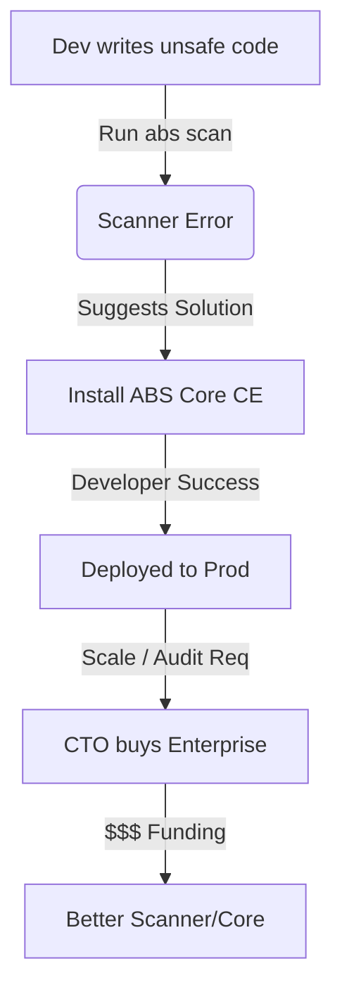

# Commercial Strategy: Open Core Model

This document outlines the business model for OConnector ABS, leveraging a "Scanner-Lead" PLG (Product-Led Growth) strategy.

## 1. The Value Tiering (The Funnel)

We split the ecosystem into three clear tiers to minimize friction for developers while capturing enterprise value.

| Tier | Component | Cost | User Persona | Value Proposition |
| :--- | :--- | :--- | :--- | :--- |
| **Hook** | `@abs/scan` | **Free** (MIT/Apache) | Dev / Tech Lead | "Finds the fire." Detects risky code patterns immediately. |
| **Foundation** | `ABS Core (CE)` | **Free** (Apache 2.0) | App Developer | "Puts out the fire." Provides the basic runtime to fix the risk locally. |
| **Scale** | `ABS Enterprise` | **Paid** (Commercial) | CTO / CISO | "Prevents future fires." Compliance, SSO, Long-term Audit, Analytics. |

## 2. Why this works

### The Scanner is the Salesman
We distribute `@abs/scan` for free. It runs in CI/CD pipeline.
When it fails a build due to "Ungoverned LLM Execution", the error message points to the solution:
> *Running `eval()` or direct LLM execution is unsafe. Install `@abs/core` to govern this action.*

### Community Edition (CE) - Adoption
The Developer installs the Open Source runtime.
- It works flawlessly for 1 instance.
- It logs to local SQLite.
- It uses config-file policies.
**Standard**: "Good enough" for 80% of apps, ensuring massive adoption.

### Enterprise Edition (EE) - Conversion
As the company scales, the CISO/CTO needs:
- **Centralized Logs**: SQLite isn't enough. They need a SaaS dashboard for 5-year retention.
- **SSO/RBAC**: Who changed the policy?
- **Policy Packs**: "Turn on HIPAA Compliance" (Templates).
- **Webhooks**: Push notifications to PagerDuty on `DENY` decisions.

## 3. License Strategy
- **Scan & Core CE**: Apache 2.0 (Permissive). Maximizes distribution.
- **Enterprise**: Proprietary Source Available OR SaaS-only.

## 4. Visualizing the Flywheel

