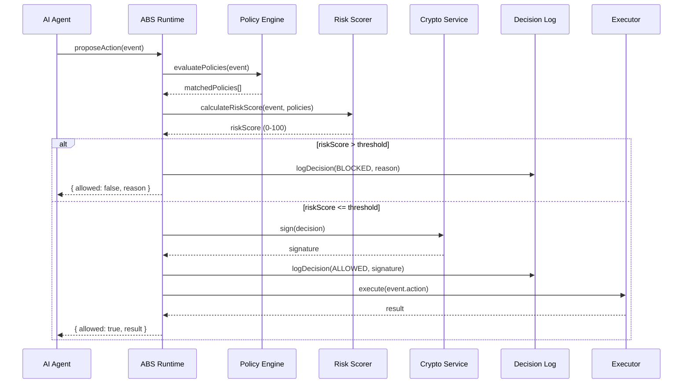

# Arquitetura ABS Core

O ABS Core opera em modelo **Event-Driven**, desacoplando a entrada (canais) da inteligência (decisão) e da saída (ação).

## Diagrama de Componentes

```mermaid
flowchart TD
    subgraph Channels ["Channels (Inputs)"]
        OBot[OBot / Chat]
        CRM[CRM Webhook]
        Manual[Backoffice UI]
    end

    subgraph Core ["ABS Core"]
        Ingest[Event Ingestion]
        Orch[Process Orchestrator]
        State[State Store]
        Decision[Decision Service]
        Policy[Policy Engine]
        ActionGW[Action Gateway]
        Audit[Audit Logger]
    end

    subgraph External ["External Systems"]
        Pay[Payment Gateway]
        ERP[ERP System]
    end

    OBot -->|Event: message_received| Ingest
    CRM -->|Event: deal_updated| Ingest
    
    Ingest -->|EventEnvelope| Orch
    
    Orch <-->|Read/Write| State
    Orch -->|Request Proposal| Decision
    
    Decision -->|DecisionProposal| Policy
    
    Policy -->|PolicyDecision (Allow/Deny)| ActionGW
    Policy -->|Log| Audit
    
    ActionGW -->|Execute| OBot
    ActionGW -->|Execute| Pay
    ActionGW -->|Execute| ERP
    ActionGW -->|Result Event| Ingest
```

## Fluxo de Decisão

1.  **Evento**: Ocorre algo no mundo (lead criado, mensagem recebida).
2.  **Estado**: Orchestrator carrega o estado atual do Processo (Saga).
3.  **Recomendação**: Decision Service (com LLM+RAG) analisa contexto e *propõe* uma ação (ex: "Oferecer 5% de desconto").
4.  **Validação**: Policy Engine verifica a proposta contra regras fixas (ex: "Desconto máximo permitido é 10%").
5.  **Execução**:
    *   Se **Allowed**: Action Gateway executa.
    *   Se **Denied**: Retorna erro ou fallback.
    *   Se **Escalate**: Envia para fila Human-in-the-Loop.
6.  **Auditoria**: Tudo é gravado no Decision Log imutável.

## Componentes Chave

### Event Ingestion
Normaliza inputs variados em um `EventEnvelope` padrão com `tenant_id`, `correlation_id` e `timestamp`. Garante que o Core fale apenas uma língua interna.

### Process Orchestrator
Gerencia o ciclo de vida de processos longos (State Machines). Sabe em que etapa um Lead está e quais transições são válidas.

### Decision Service
O "cérebro criativo". Monta o prompt, consulta RAG, chama o LLM. A saída é estruturada (JSON) e é apenas uma *proposta*.

### Policy Engine
O "cérebro racional". Kode-as-policy ou Rules Engine. Determinístico. Sua função é dizer SIM, NÃO ou TALVEZ (Humano) para a proposta da IA.

### Action Gateway
O único ponto que toca o mundo externo. Implementa Rate Limiting, Circuit Breakers e Retries. Garante que nada executa sem um `policy_decision: allow`.

---

## 🔄 Sequence Diagram



---

## 🔌 LLM Framework Integration

### LangChain (Planned Q1 2026)

```typescript
import { ABSCheckTool } from '@abs/langchain';

const agent = new AgentExecutor({
  tools: [new ABSCheckTool({ apiKey: process.env.ABS_TOKEN })],
});
```

### Direct API

```typescript
POST /api/events
{
  "eventType": "file:delete",
  "payload": { "path": "/etc/passwd" },
  "agentId": "cursor-agent-1"
}
```

---

## 📊 Performance Characteristics

| Layer | Latency | Notes |
|-------|---------|-------|
| Policy Evaluation | ~1ms | In-memory rule matching |
| Risk Scoring | ~0.5ms | Weighted calculation |
| Crypto Signing | ~0.3ms | HMAC-SHA256 |
| DB Write | ~5-10ms | SQLite/D1 dependent |
| **Total Overhead** | **~8-15ms** | P99 < 20ms |

---

## 🔗 Related Documentation

- [PERFORMANCE.md](PERFORMANCE.md) - Benchmark methodology
- [METRICS.md](METRICS.md) - Public KPIs
- [SECURITY_MODEL.md](SECURITY_MODEL.md) - Threat model
