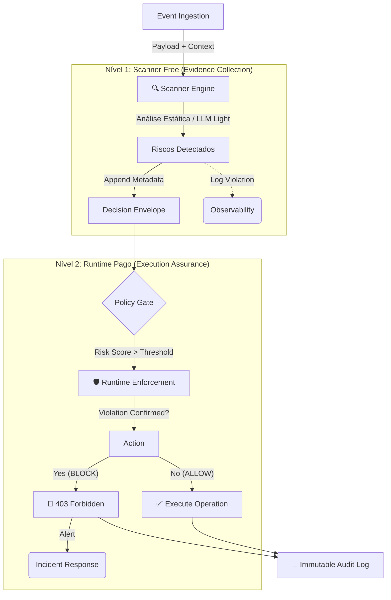

# Arquitetura de Confiança: Scanner Free vs. Runtime Pago

> "O problema não é IA per se, é ação sem prova."

Esta arquitetura implementa dois níveis distintos de confiança e governança dentro do ABS Core, permitindo uma gradação de risco desde a detecção até a execução crítica.

## 1. Visão Geral Comparativa

| Critério | **Scanner Free** (`ABS_MODE=scanner`) | **Runtime Pago** (`ABS_MODE=runtime`) |
| :--- | :--- | :--- |
| **Objetivo** | Detecção antecipada, "Filtro Zero" | Confiança Operatival, "Gate Final" |
| **Comportamento** | Passivo (`MONITOR`) | Ativo (`BLOCK / ENFORCE`) |
| **Decisão** | Gera evidência de violação | Impede a ação insegura |
| **Custo/Risco** | Baixo custo / Risco de falso negativo | Alto valor / Segurança crítica (Zero Trust) |
| **Uso Ideal** | Dev-time, CI/CD, Observabilidade | Produção, Financeiro, Compliance |

---

## 2. Diagrama de Fluxo de Decisão

O fluxo abaixo ilustra como o mesmo `Decision Envelope` trafega pelos dois estágios, acumulando provas.

## 3. Implementação Técnica

### Mode Switching (`ABS_MODE`)

O núcleo do sistema (`EventProcessor`) altera seu comportamento de enforcement baseado na variável de ambiente `ABS_MODE`.

- **Scanner Mode**: Executa todas as políticas. Se o resultado for `DENY`, ele registra a intenção no log (`decision: DENY`) mas altera a execução para `MONITOR` (200 OK), adicionando metadata `scanner_override: true`.
- **Runtime Mode**: Executa todas as políticas. Se o resultado for `DENY`, ele bloqueia imediatamente (`403 Forbidden`) e registra a ação bloqueada.

### Fluxo de Dados

1. **Ingestão**: Evento chega via API ou Queue.
2. **Avaliação**: LLM/Policy avalia o risco.
3. **Decisão Bruta**: O sistema calcula a decisão ideal (`ALLOW`, `DENY`, `ESCALATE`).
4. **Aplicação de Modo**:
   - Se `Scanner` && `DENY`: `Force ALLOW` + `Log Warning`.
   - Se `Runtime` && `DENY`: `Exec DENY`.
5. **Persistência**: O log de decisão é imutável e reflete a *intenção original* da política, garantindo que o dashboard mostre os riscos reais que *seriam* bloqueados no modo Runtime.

## 4. Metáfora de Comunicação

- **Scanner Free** = **Detector de Fumaça**. Ele apita, avisa que há um problema, mas não apaga o fogo. É vital para alerta.
- **Runtime Pago** = **Sistema de Sprinklers Automático**. Ele detecta o fogo E age imediatamente para conte-lo, protegendo o patrimônio (business value) automaticamente.
