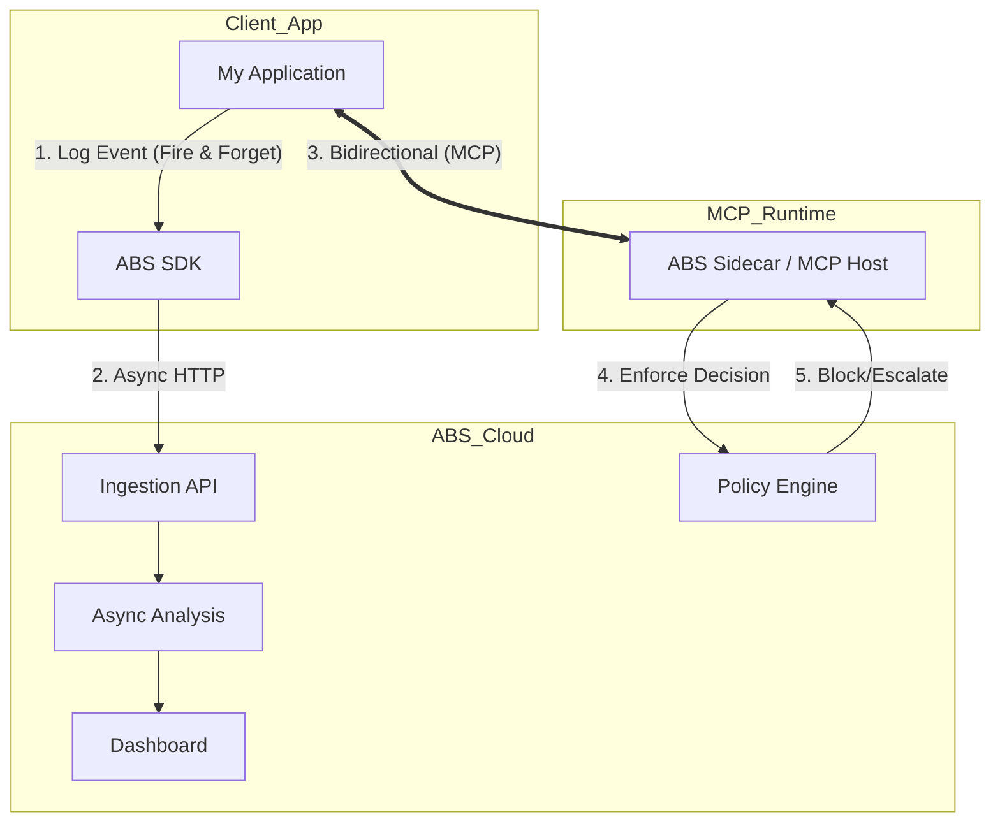

# Product Strategy: Scanner vs Runtime (The "Sentry" Model)

## Concept
Separating the offering into two distinct integration tiers to reduce friction (Scanner) and maximize value (Runtime).

## Tier 1: ABS Scanner (The "Sentry" Layer)
**Value**: "Forensic Observability & Audit"
- **Mechanism**: Unidirectional (App -> ABS).
- **Integration**: `npm install @abs/scan`.
- **Latency**: Near zero (Fire-and-forget).
- **Feature**: "See what your AI is doing". Captures prompts, PII, hallucination risks.
- **Price**: Free / Volume-based.

## Tier 2: ABS Runtime (The "Firewall" Layer)
**Value**: "Governance & Prevention"
- **Mechanism**: Bidirectional / Synchronous (App <-> ABS).
- **Integration**: MCP Server or Middleware Proxy.
- **Latency**: Added latency for evaluation (Policy check).
- **Feature**: "Control what your AI does". Blocks injection, requires human approval (Escalate), prevents sensitive data leaks.
- **Price**: Enterprise / Per-Decision.

## Technical Implication
Currently, `abs-core` handles both. We should split:
1.  **`@abs/sdk`**: Lightweight Node/Python library for ingestion only.
2.  **`@abs/core`**: The active server (which connects via MCP or HTTP Middleware).
